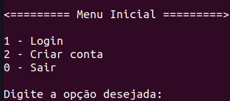
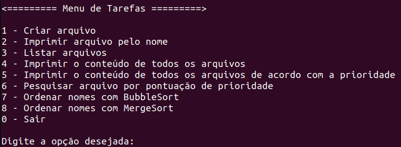
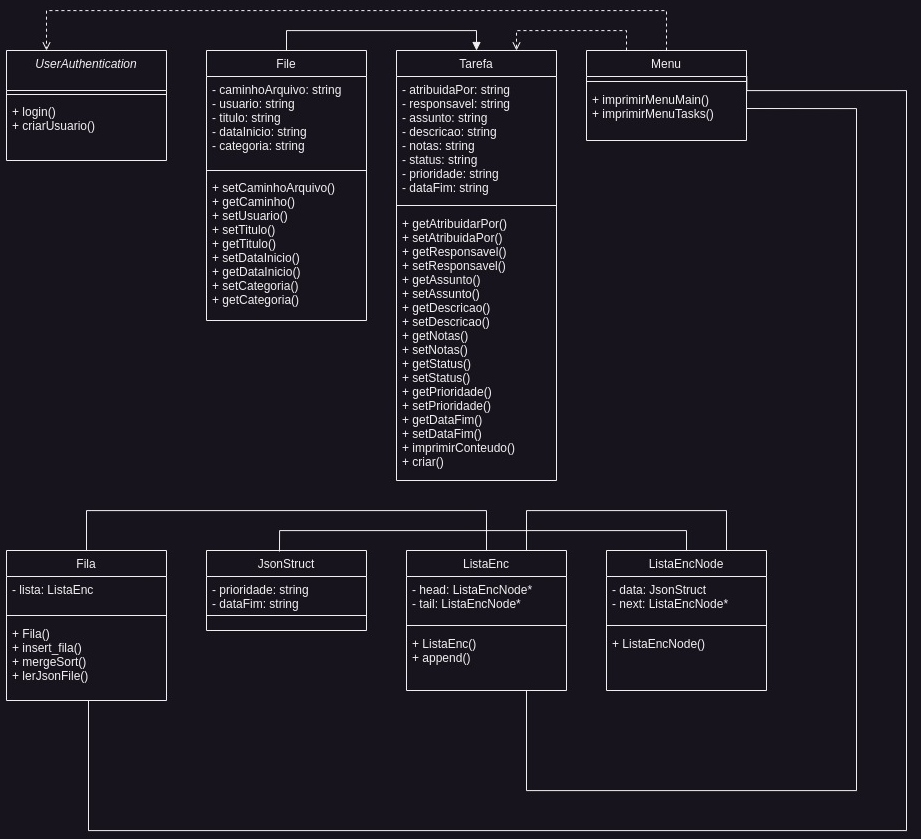

O projeto ainda está em contrução.

# Gerenciador de tarefas
Gerenciador de tarefas em C++! Esse aplicativo possui uma tela inicial de login, e, em seguida, com o usuário já autenticado, o programa cria uma pasta no nome do novo usuário e imprime um menu de tarefas. 
  
Por sua vez, o menu de tarefas permite a criação de tarefas, impressão de tarefas por nome, impressão do nome de todas as tarefas, impressão do conteúdo de todas a tarefas, impressão de todas as tarefas ordenadas por prioridades, busca de uma tarefa com um determinando valor, e por fim, a impressão do nome de todas as tarefas em ordem alfabética.
 
<!---Adicionar fotos dos menus aqui ---->

## Diagrama de classes

## Estrutura de pastas do projeto

<ul>
<li>/src: Código fonte (.cpp). </li>
<li>/include: Cabeçalhos contendo a assinatura das classes/funções (.hpp). </li>
<li>/docs: Documentação do projeto, incluindo as imagens. </li>
<li>/data: Arquivos em json com o conteúdo das tarefas criadas pelos usuários. </li>
<li>makefile: diretrizes para a compilação.</li>

</ul>

### Exemplo de TaskFile

{ 
  "caminhoArquivo": "caminho/do/arquivo", 
  "usuario": "Terminal Root", 
  "titulo": "Marcos Oliveira", 
  "dataInicio": "2023-06-09", 
  "categoria": "Tarefa", 
  "atribuidaPor": "João Silva", 
  "responsavel": "Marcos Oliveira", 
  "assunto": "Implementação do recurso XYZ", 
  "descricao": "Detalhes da tarefa a ser realizada", 
  "notas": "Notas adicionais sobre a tarefa", 
  "status": "Em andamento", 
  "prioridade": "Alta", 
  "dataFim": "03/02/2024", 
  "pontuacaoPrioridade": 10; 
} 
