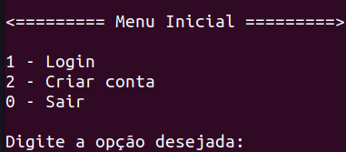
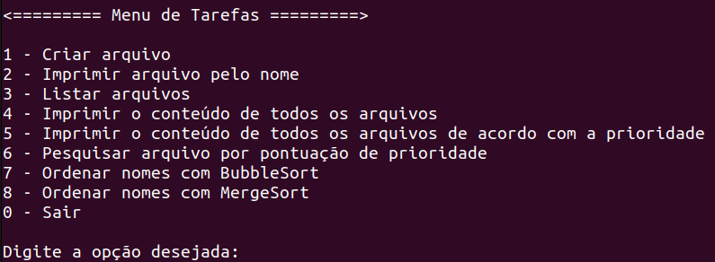
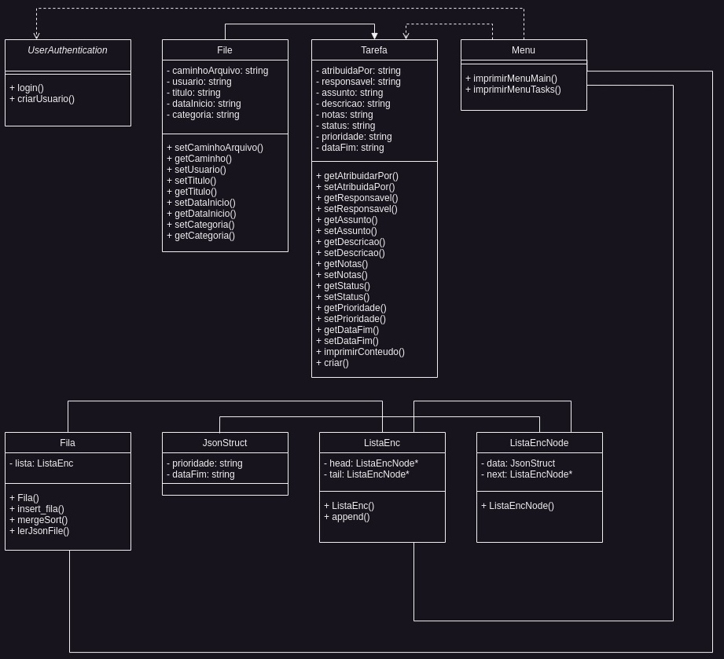

O projeto ainda está em contrução.

# Gerenciador de tarefas
Gerenciador de tarefas em C++! Esse aplicativo possui uma tela inicial de login, e, em seguida, com o usuário já autenticado, o programa cria uma pasta no nome do novo usuário e imprime um menu de tarefas. 
  
Por sua vez, o menu de tarefas permite a criação de tarefas, impressão de tarefas por nome, impressão do nome de todas as tarefas, impressão do conteúdo de todas a tarefas, impressão de todas as tarefas ordenadas por prioridades, busca de uma tarefa com um determinando valor, e por fim, a impressão do nome de todas as tarefas em ordem alfabética.
 
<!---Adicionar fotos dos menus aqui ---->

### Exemplo de TaskFile

{ 
  "caminhoArquivo": "caminho/do/arquivo", 
  "usuario": "Terminal Root", 
  "titulo": "Marcos Oliveira", 
  "dataInicio": "2023-06-09", 
  "categoria": "Tarefa", 
  "atribuidaPor": "João Silva", 
  "responsavel": "Marcos Oliveira", 
  "assunto": "Implementação do recurso XYZ", 
  "descricao": "Detalhes da tarefa a ser realizada", 
  "notas": "Notas adicionais sobre a tarefa", 
  "status": "Em andamento", 
  "prioridade": "Alta", 
  "dataFim": "03/02/2024", 
  "pontuacaoPrioridade": 10; 
} 

## Diagrama de classes

## Estrutura de pastas do projeto

<ul>
<li>/src: Código fonte (.cpp). </li>
<li>/include: Cabeçalhos contendo a assinatura das classes/funções (.hpp). </li>
<li>/docs: Documentação do projeto, incluindo as imagens. </li>
<li>/data: Arquivos em json com o conteúdo das tarefas criadas pelos usuários. </li>
<li>makefile: diretrizes para a compilação.</li>

</ul>

## Complexidade
Merge Sort:

O Merge Sort é um algoritmo de ordenação eficiente e de complexidade O(n log n).
Ele divide a lista não ordenada em sublistas menores, classifica-as recursivamente e, em seguida, mescla essas sublistas classificadas para obter a lista final ordenada.
O Merge Sort tem um desempenho consistente em diferentes tamanhos de entrada e é amplamente utilizado para ordenar grandes conjuntos de dados.
No entanto, o Merge Sort requer espaço adicional para armazenar as sublistas durante a mesclagem, o que pode ser um fator limitante em casos com restrições de memória.
Busca Binária:

A Busca Binária é um algoritmo de busca eficiente em listas ordenadas e tem complexidade O(log n).
Ele divide repetidamente a lista ao meio, descartando a metade na qual o elemento buscado não pode estar, até encontrar o elemento desejado ou concluir que ele não está presente.
A Busca Binária é muito mais rápida do que a busca sequencial em listas ordenadas, especialmente em grandes conjuntos de dados.
No entanto, a Busca Binária requer que a lista esteja ordenada para funcionar corretamente.
Linked List:

A Linked List é uma estrutura de dados em que os elementos são armazenados em nós que contêm um valor e um ponteiro para o próximo nó.
A Linked List permite a inserção e remoção eficientes de elementos em qualquer posição, pois não requer realocação de memória.
No entanto, o acesso aos elementos em uma Linked List não é tão eficiente quanto em estruturas de dados como arrays, pois requer percorrer a lista sequencialmente até encontrar o elemento desejado.
A Linked List é ideal quando as operações de inserção e remoção são frequentes e o acesso aleatório aos elementos é menos importante.
Fila:

A Fila é uma estrutura de dados em que os elementos são adicionados ao final e removidos do início, seguindo a política FIFO (First-In-First-Out).
A inserção e remoção de elementos em uma Fila são eficientes, com complexidade O(1).
As Filas são frequentemente utilizadas em cenários em que a ordem de chegada é importante, como processamento de tarefas em um sistema ou gerenciamento de requisições.
No entanto, o acesso a elementos em posições intermediárias da Fila não é eficiente, pois requer percorrer os elementos anteriores.

